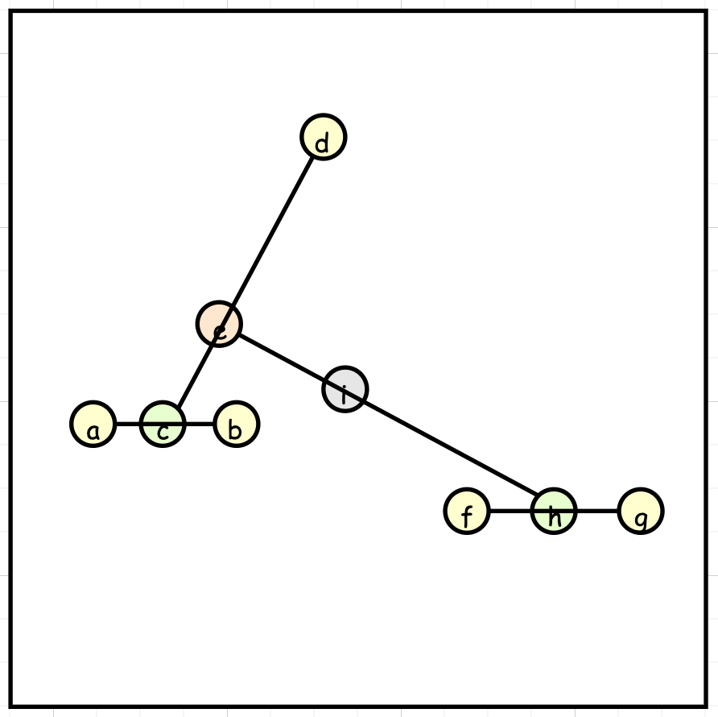
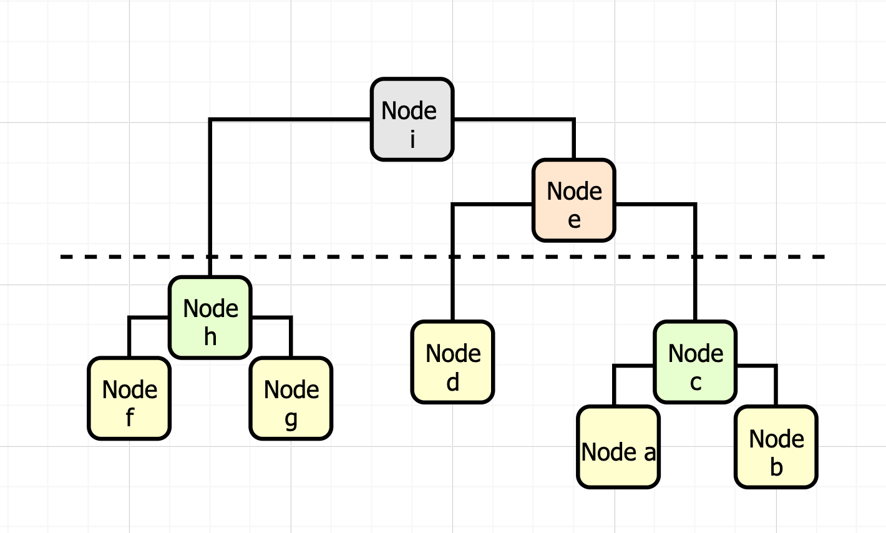

**Task**: you are going to implement a clustering algorithm called **centroid hierarchical clustering algorithm** to hierarchically group N 2-dimensional points in the plane and generate a clustering tree.

In the cluster function, we input those yellow points in Figure 1 and set cluster_num=1 (as demo), you should build a cluster tree as shown in Figure 2, and return the coordinates of the cluster.

Figure 1.


Figure 2.


---

Your construction function will receive an list of array(Each array has two elements: x,y). The clustering procedures are described as follows:

- Step 0: Treat each point as a cluster;
- Step 1: Find the nearest pair of clusters (a, b) among the remaining N clusters
- Step 2: Create a new cluster, c, of which the coordinates are the centroid of all the points it contains after merging the clusters a and b;
- Step 3: Delete the two old clusters: a and b;
- Step 4: N = N - 1;
- Step 5: Re-calculate the distance of the new cluster, c, to the other remaining clusters;
- Step 6: go to Step 1 unless N = cluster_num

Output the centroid of those N cluster in the sorted order of (x,y) pairs. (Sorted x in the increaing order. If x is equal, sorted y in the increaing order)

**Hint**: Priority Queue

---

**Template** and **Example**
```python

from typing import List
import heapq
class Cluster:
    def cluster(self, points: List[List[int]], cluster_num: int) -> List[List[float]]:
        """ 
        Cluster the points to cluster_num clusters.
        Output the sorted center coordination of those clusters.
        """ 
        return sorted([[0,0]])


if __name__ == "__main__":
    print(Cluster().cluster([[0,0], [1,0], [3,0], [0,1]], 2)) 
    # [[0.3333333333333333, 0.3333333333333333], [3, 0]] 
    # [0,0], [1,0], [0,1] are in same cluster
    # [3,0] are in another cluster

    print(Cluster().cluster([[0,3], [3,3], [4,7], [9,0], [9,4]], 3)) 
    # [[1.5, 3.0], [4, 7], [9.0, 2.0]]

    print(Cluster().cluster([[0,1], [0,2], [3,1], [3,2]], 2)) 
    # [[0.0, 1.5], [3.0, 1.5]]
```

---

**Test Case**
1. `0 <= x,y <= M`, x and y are integers.
We guarantee the coordinates are unique
2. `N` is the number of points
3. We check your answer by `abs(output - answer) <= 1e-3`
4. `2 <= Cluster number <= 5`
5. We guarantee there is only one solution.


- 20 points: `N <= 10`, `M <= 20`
- 20 points: `N <= 500`, `M < 1000000` 
- 20 points: `N <= 100`, `M <= 100`
- 20 points: `N <= 400`, `M <= 1000`
- 20 points: `N <= 700`, `M <= 10000`
